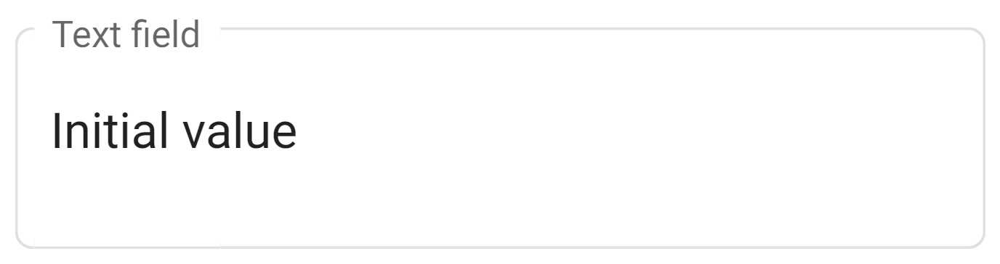

# Data Fields

In engine there are multiple supported field types which can be used, when creating form. Some types can have multiple
views depending on the use case. Here is the overview of all types with their views (components). Views can be changed
via `<component>` `<name>` tag E.g.:

```xml

<data type="i18n">
    <id>i18n_field</id>
    <title>Title</title>
    <placeholder>Placeholder</placeholder>
    <init name="i18n_field_translation">Init value</init>
    <component>
        <name>divider</name>
    </component>
</data>
```

In the next section of document, if (default) is mentioned in component part, it means you don't have to specify
`<name>` tag in the field component.

## Boolean field

> Coming soon

## Button field

> Coming soon

#### Component

* `basic` (default)
* `raised`
* `stroked`
* `flat`
* `icon`
* `fab`
* `minifab`

Please refer to [Angular material button guide](https://material.angular.io/components/button/overview), to find out
design of each button.

## Date field

> Coming soon

## Datetime field

> Coming soon

## Enumeration field

> Coming soon

#### Component

* `select` (default)
* `autocomplete_dynamic`
* `autocomplete`
* `list`
* `stepper`
* `icon`

## File field

Servers for uploading file to the server. File is persisted in server storage, until user deletes the file or uploads
another file on top of the existing one. If new file is uploaded, old one is deleted from the storage. Exception in this
behavior is, when you try to upload file with the same name as already uploaded file. In that case, you need to rename
file, you are trying to upload or delete uploaded file and then re-upload new file. File field saves name of the file
and
path to the file in the application storage.

File field has two views. **default** view has only an upload button and file name (which adds possibility to download
file
on click) in its field input. **preview** extends **default** view with preview of uploaded file. Preview is supported
only for these file formats: jpg, jpeg, png, pdf

#### Component

* `default` (default)
* `preview`

## File list field

Similarly to file field, this one also servers to upload file to the server, but in this case, it can handle multiple
files at the same time. Unlike file field, file list field has only one view, because you cannot display preview for
multiple files in good way. You can upload new files to this field, but similarly to file field, you cannot upload files
with same names as already uploaded files. You can rename files, you want to upload or delete already uploaded files.

File list field has only a default view, which looks similarly to file field default view, but there is a list of
uploaded
files names instead of just one file name.

This field also has one validation for maximum number of uploaded files `maxFiles`, which can be set in xml document.

## Filter field

> Coming soon

## I18n field

This field servers to support translations in the application. Value of this field is I18nType, which means, you can set
default value of this field with translations in all languages you want.

This field has two views. First one is **text** view, which is similar to text field in visible form. In editable form
you can choose multiple translations as value of this field. Second one is **divider**
form which is displayed as horizontal line with text (text is optional). This divider view is customizable with font
size and divider line color.

This field has two validations:

* `translationRequired` - accepts language codes separated by comma, that are required (
  eg. `translationRequired sk,pl,cz`)
* `translationOnly` - accepts language codes separated by comma, that are only allowed in field (
  eg. `translationOnly sk,pl,cz,en`)

#### Component

* `text` (default)
* `divider`

#### Properties

In **divider** view, i18n field supports these properties:

* `fontSize` - defines size of text font between divider lines
* `dividerColor` - defines color of the divider line

In **text** view, i18n field supports these properties (disabled behavior):

* `plainText` - defines view of text field, if false, field is displayed as disabled text field, otherwise it is
  displayed as plain text
* `fontSize` - defines size of text font
* `dividerColor` - defines color of the text

## Multichoice field

> Coming soon

#### Component

* `select` (default)
* `list`

## Number field

> Coming soon

#### Component

* `default` (default)
* `currency`

## Text field

A Text Field is a user interface element used for inputting text data. It typically appears as a rectangular box or
input area in which users can enter text, such as names, descriptions, or other free-form text. The value of this field
is a string of text that can be manipulated by the application as needed.

This field has a single view, which is the text view, where the input area is visible and editable by the user. The
input area may have additional formatting options such as font size, color, or alignment, depending on the application's
design. The text field can also have validation rules, such as a maximum length or allowed character set, to ensure that
the data entered is valid and usable by the application.

```xml

<data type="text">
    <id>text_0</id>
    <title>Text field</title>
    <init>Initial value</init>
</data>
```



#### Value

* `String`

```Netgrif Actions API
text_0: f.text_0;
change text_0 value {  "New text field value."; }
```

#### Component

* `simple` (default)
* `password`
* `textarea`
* `richtextarea`
* `htmltextarea`

```xml

<data type="text">
    <id>text_0</id>
    <title>Text field</title>
    <init>Initial value</init>
    <component>
        <name>textarea</name>
    </component>
</data>
```

## User field

> Coming soon
